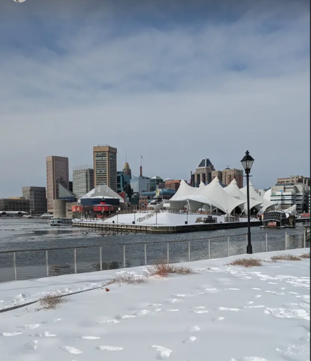

[![AGPL-3.0][agpl3-shield]][agpl3]
[![CC BY-SA 4.0][cc-by-sa-shield]][cc-by-sa]

We are not the first "Cytometry in R" course, nor will we be the last. If this is your first R course, now that we are about a third of the way through the course (and you have some general R knowledge, context, and troubleshooting skills), exploring how others approached some of these same initial subjects may be useful if you want to dive deeper. 

This page links to existing online Cytometry in R resources that I have encountered and benefited from during my own learning journey. Not all the code as presented may still work, as R packages evolve over time, so some troubleshooting may be necessary on your end to replicate what they show. Good luck, and may you find some useful concepts to further help you along on your own journeys! 

 

---

# Christopher Hall - Flow Cytometry Data Analysis in R

[Christopher Hall](https://uk.linkedin.com/in/christopher1hall) (currently at University of Edinburgh) created a series of YouTube videos on how to implement flow cytometry analysis in R. In the course of an hour, he provides an overview of many of the same topics we looked at over the first 8 weeks. I first encountered these videos late 2021/early 2022, and they were immensely helpful in getting started. 

### Installation and Loading Data

[(1) Flow Cytometry Data Analysis in R - Installation and Loading Data](https://youtu.be/2INqQNMNaV0?si=h_3Xa3bIBr0E9199)

<iframe width="560" height="315" src="https://www.youtube.com/embed/2INqQNMNaV0?si=h_3Xa3bIBr0E9199" title="YouTube video player" frameborder="0" allow="accelerometer; autoplay; clipboard-write; encrypted-media; gyroscope; picture-in-picture; web-share" referrerpolicy="strict-origin-when-cross-origin" allowfullscreen></iframe>

### Compensation, Cleaning, Transformation, Visualization

[(2) Flow Cytometry Data Analysis in R: compensation, cleaning, transformation, visualization](https://www.youtube.com/watch?v=WWa7dwwiLvI&list=PLonl5DIJ0E5_nLR2iF9bILHB1W7a5LGqO&index=3)

<iframe width="560" height="315" src="https://www.youtube.com/embed/WWa7dwwiLvI?si=69AmgoLOPx9AQ9J9" title="YouTube video player" frameborder="0" allow="accelerometer; autoplay; clipboard-write; encrypted-media; gyroscope; picture-in-picture; web-share" referrerpolicy="strict-origin-when-cross-origin" allowfullscreen></iframe>

### Gating with flowWorkspace

[(3) Flow Cytometry Data Analysis in R: gating with flowWorkspace](https://youtu.be/ijHOGHP82EY?si=87OB8t8wynJNnTf3)

<iframe width="560" height="315" src="https://www.youtube.com/embed/ijHOGHP82EY?si=-kAM2ExNW4Og0y3U" title="YouTube video player" frameborder="0" allow="accelerometer; autoplay; clipboard-write; encrypted-media; gyroscope; picture-in-picture; web-share" referrerpolicy="strict-origin-when-cross-origin" allowfullscreen></iframe>

### Visualization

[(4) Flow Cytometry Data Analysis in R: Visualisation](https://youtu.be/Y7_ux9Py3Vg?si=2wG5WmI8n3IBCyHD)

<iframe width="560" height="315" src="https://www.youtube.com/embed/Y7_ux9Py3Vg?si=ccA_FHYByh_2k9nk" title="YouTube video player" frameborder="0" allow="accelerometer; autoplay; clipboard-write; encrypted-media; gyroscope; picture-in-picture; web-share" referrerpolicy="strict-origin-when-cross-origin" allowfullscreen></iframe>

 

---

# Ozette Technologies - BioC 2023 Workshop

During the [Bioc2023](https://bioc2023.bioconductor.org/) conference in Boston, Arpan Neupane and Andrew McDavid, who were working at [Ozette](https://ozette.com/) gave a workshop on how to use flowWorkspace and the other R packages that they maintain. I didn't make it to the workshop (misread the room number and ended up in an interesting parallel computing talk), but went through the material on the train ride back to Baltimore. In the process, I found out about the memory benefits of using "cytosets" and how to implement `openCyto` gates, which fast forward a few years has led to much of the general workflow showcased throughout the Cytometry in R course. 

[Workshop: Reproducible and programmatic analysis of flow cytometry experiments with the cytoverse](https://youtu.be/_8x-prIxJgw?si=Tm-QoBQ3qc568xXD)

<iframe width="560" height="315" src="https://www.youtube.com/embed/_8x-prIxJgw?si=Tm-QoBQ3qc568xXD" title="YouTube video player" frameborder="0" allow="accelerometer; autoplay; clipboard-write; encrypted-media; gyroscope; picture-in-picture; web-share" referrerpolicy="strict-origin-when-cross-origin" allowfullscreen></iframe>

 

---

# Bioinformatics DotCa - Introduction to Flow Cytometry in R

One of the older Cytometry in R series on YouTube compromising a workshop series by [Ryan Brinkman](https://www.bccrc.ca/dept/tfl/people/ryan-brinkman)'s group. While I didn't encounter them until much later, they influenced many of the other video series you can see on this page. Some of the code is starting to show its age, as quite a few of the R packages have been superseeded (especially when it comes to gating and visualization), but still worthwhile watching. 

### Introduction to Flow Cytometry in R

[Introduction to Flow Cytometry in R](https://youtu.be/0_dN8VKhOJ0?si=Mn7UB0Gps5twqAqK)

<iframe width="560" height="315" src="https://www.youtube.com/embed/0_dN8VKhOJ0?si=Mn7UB0Gps5twqAqK" title="YouTube video player" frameborder="0" allow="accelerometer; autoplay; clipboard-write; encrypted-media; gyroscope; picture-in-picture; web-share" referrerpolicy="strict-origin-when-cross-origin" allowfullscreen></iframe>

### Exploring FCM Data in R

[Exploring FCM Data in R](https://youtu.be/IE8X32HVA9I?si=0xTVBGWanRele4WT)

<iframe width="560" height="315" src="https://www.youtube.com/embed/IE8X32HVA9I?si=0xTVBGWanRele4WT" title="YouTube video player" frameborder="0" allow="accelerometer; autoplay; clipboard-write; encrypted-media; gyroscope; picture-in-picture; web-share" referrerpolicy="strict-origin-when-cross-origin" allowfullscreen></iframe>

### Processing and Quality Assurance of FCM Data

[Processing and Quality Assurance of FCM Data](https://youtu.be/OnAcZzBSc54?si=Z-RijMLvhvxqXvV2)

<iframe width="560" height="315" src="https://www.youtube.com/embed/OnAcZzBSc54?si=CWgamCbSBm4z8Jrx" title="YouTube video player" frameborder="0" allow="accelerometer; autoplay; clipboard-write; encrypted-media; gyroscope; picture-in-picture; web-share" referrerpolicy="strict-origin-when-cross-origin" allowfullscreen></iframe>

### 1D Dynamic Gating

[1D Dynamic Gating](https://youtu.be/Yd_IPMDFm4Y?si=9OikOeFnkEMCRURl)

<iframe width="560" height="315" src="https://www.youtube.com/embed/Yd_IPMDFm4Y?si=9OikOeFnkEMCRURl" title="YouTube video player" frameborder="0" allow="accelerometer; autoplay; clipboard-write; encrypted-media; gyroscope; picture-in-picture; web-share" referrerpolicy="strict-origin-when-cross-origin" allowfullscreen></iframe>

### Clustering and Additional FCM Tools

[Clustering and Additional FCM Tools](https://youtu.be/xnvNCsu56Vo?si=botz0swIm31W5340)

<iframe width="560" height="315" src="https://www.youtube.com/embed/xnvNCsu56Vo?si=botz0swIm31W5340" title="YouTube video player" frameborder="0" allow="accelerometer; autoplay; clipboard-write; encrypted-media; gyroscope; picture-in-picture; web-share" referrerpolicy="strict-origin-when-cross-origin" allowfullscreen></iframe>

# Givanna Putri and Thomas Ashhurst - Introduction to Cytometry Data Analysis in R workshop

One of Givanna Putri and Thomas Ashurst Zoom-era workshops, provides a good overview of some of the R knowledge and concepts that are needed to subsequently be able to use their [Spectre](https://immunedynamics.io/Spectre/) R package to setup a pipeline. 

[ACS 2021 Workshops - Introduction to Cytometry Data Analysis in R workshop](https://youtu.be/-0QrXgk_NRw?si=GqcjU-_MQ3UvYwvI)

<iframe width="560" height="315" src="https://www.youtube.com/embed/-0QrXgk_NRw?si=GqcjU-_MQ3UvYwvI" title="YouTube video player" frameborder="0" allow="accelerometer; autoplay; clipboard-write; encrypted-media; gyroscope; picture-in-picture; web-share" referrerpolicy="strict-origin-when-cross-origin" allowfullscreen></iframe>

 

---

# Ryan Duggan - Cytometry on Air

Also in the older one-off workshops category, this presentation TJ Chen and Greg Finak is similar to the Bioinformatics DotCa videos in the timeline, and has been the introduction to CytometryInR for many of the authors of the other video tutorials. 

[Cytometry on Air: Analyzing Flow Cytometry Data in R](https://www.youtube.com/live/_B7mo6dB3BU?si=eW20X4YWgaCoYnfw) Presentation by ,

<iframe width="560" height="315" src="https://www.youtube.com/embed/_B7mo6dB3BU?si=eW20X4YWgaCoYnfw" title="YouTube video player" frameborder="0" allow="accelerometer; autoplay; clipboard-write; encrypted-media; gyroscope; picture-in-picture; web-share" referrerpolicy="strict-origin-when-cross-origin" allowfullscreen></iframe>

 

---

# Pritam Kumar Panda 

One of the more recent tutorial series I encountered in the last year, while relying on a couple different packages, shares a lot of packages with our course toolchain, so worth checking out to see how the topics are approached from another angle. 

### Complete Guide

[Flow Cytometry Data Analysis & Visualization in R using CytoExploreR: Complete Guide](https://youtu.be/AvIvRorrh8c?si=MVViua5fSBrahtzv)

<iframe width="560" height="315" src="https://www.youtube.com/embed/AvIvRorrh8c?si=QektorbguSVJ_lP-" title="YouTube video player" frameborder="0" allow="accelerometer; autoplay; clipboard-write; encrypted-media; gyroscope; picture-in-picture; web-share" referrerpolicy="strict-origin-when-cross-origin" allowfullscreen></iframe>

 

### Flow Cytometry Data Analysis & Visualization in R using CytoExploreR

[Flow-Cytometry-analysis-in-R](https://github.com/pritampanda15/Proteomics/tree/main/Flow-Cytometry-analysis-in-R-main)

[CytoExploreR-Interactive-visualization](https://github.com/pritampanda15/Proteomics/tree/main/CytoExploreR-Interactive-visualization-main)

---

# Tulika Rai - Learn Innovatively With Me

One of the more recent tutorial series I encountered in the last year, while a bit more focused on a particular application than the other video series, once you have some additional R context it is worth checking out. 

### flowAI Flow Cytometry Data Cleaning using R

[flowAI Flow Cytometry Data Cleaning using R: A Step-by-step Tutorial](https://youtu.be/PvB37SEe7lI?si=X3iYcGT7A3G603oP)

<iframe width="560" height="315" src="https://www.youtube.com/embed/PvB37SEe7lI?si=fhbmhs1vXdw0Fkzo" title="YouTube video player" frameborder="0" allow="accelerometer; autoplay; clipboard-write; encrypted-media; gyroscope; picture-in-picture; web-share" referrerpolicy="strict-origin-when-cross-origin" allowfullscreen></iframe>

### tSNE UMAP TRIMAP colorization or Transformation using R script 

[tSNE UMAP TRIMAP colorization or Transformation using R script ](https://youtu.be/l9dg4QUYSOM?si=gW218zzDqQEtjtpY)

<iframe width="560" height="315" src="https://www.youtube.com/embed/l9dg4QUYSOM?si=gW218zzDqQEtjtpY" title="YouTube video player" frameborder="0" allow="accelerometer; autoplay; clipboard-write; encrypted-media; gyroscope; picture-in-picture; web-share" referrerpolicy="strict-origin-when-cross-origin" allowfullscreen></iframe>

 

---

# Others

The additional resources below are ones that I encountered while building this Existing Resources page, but have not had time to fully watch yet. 

### Timothy Keyes - 

[{tidytof}: Predicting Patient Outcomes from Single-cell Data using Tidy Data Principles](https://youtu.be/5NhpC836aSc?si=QqoeW31cQcHFzu5W)

<iframe width="560" height="315" src="https://www.youtube.com/embed/5NhpC836aSc?si=QqoeW31cQcHFzu5W" title="YouTube video player" frameborder="0" allow="accelerometer; autoplay; clipboard-write; encrypted-media; gyroscope; picture-in-picture; web-share" referrerpolicy="strict-origin-when-cross-origin" allowfullscreen></iframe>

 

---

### Hong Qin - flow analysis in R

#### Flow Analysis in R

[flow analysis in R, bio125, Spring 2015](https://youtu.be/r7Mf6joCNzM?si=5j9Fy8fn6d7o0Z-u)

<iframe width="560" height="315" src="https://www.youtube.com/embed/r7Mf6joCNzM?si=5j9Fy8fn6d7o0Z-u" title="YouTube video player" frameborder="0" allow="accelerometer; autoplay; clipboard-write; encrypted-media; gyroscope; picture-in-picture; web-share" referrerpolicy="strict-origin-when-cross-origin" allowfullscreen></iframe>

####  Flow Cytometer Data Analysis

[BIO233 demo, flow cytometer data analysis, simple example](https://youtu.be/BN5Ldu1AFgk?si=FV2K7jJGe9H6na08)

<iframe width="560" height="315" src="https://www.youtube.com/embed/BN5Ldu1AFgk?si=FV2K7jJGe9H6na08" title="YouTube video player" frameborder="0" allow="accelerometer; autoplay; clipboard-write; encrypted-media; gyroscope; picture-in-picture; web-share" referrerpolicy="strict-origin-when-cross-origin" allowfullscreen></iframe>

 

---

### Swayam Prabha - Flow cytometry data analysis in R/Bioconductor

[Lecture 15 : Flow cytometry data analysis in R/Bioconductor](https://youtu.be/g-VUT3riwOM?si=SlX88J3HpsjYaqFI)

<iframe width="560" height="315" src="https://www.youtube.com/embed/g-VUT3riwOM?si=SlX88J3HpsjYaqFI" title="YouTube video player" frameborder="0" allow="accelerometer; autoplay; clipboard-write; encrypted-media; gyroscope; picture-in-picture; web-share" referrerpolicy="strict-origin-when-cross-origin" allowfullscreen></iframe>

 

---

### Guillaume Beyrend - Learn Cytometry

[Learn Cytometry](https://learncytometry.com/videos/) Originally appeared to have been pay-walled, doesn't currently appear to be the case. Has a very different teaching approach from my own.

 

---

[![AGPL-3.0][agpl3-image]][agpl3]
[![CC BY-SA 4.0][cc-by-sa-image]][cc-by-sa]

[cc-by-sa]: http://creativecommons.org/licenses/by-sa/4.0/
[cc-by-sa-image]: https://licensebuttons.net/l/by-sa/4.0/88x31.png
[cc-by-sa-shield]: https://img.shields.io/badge/License-CC%20BY--SA%204.0-lightgrey.svg
[agpl3]: https://www.gnu.org/licenses/agpl-3.0.en.html
[agpl3-image]: https://www.gnu.org/graphics/agplv3-with-text-162x68.png
[agpl3-shield]: https://img.shields.io/badge/license-AGPLv3-blue