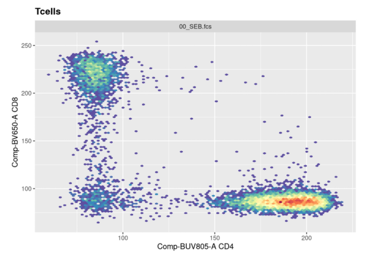
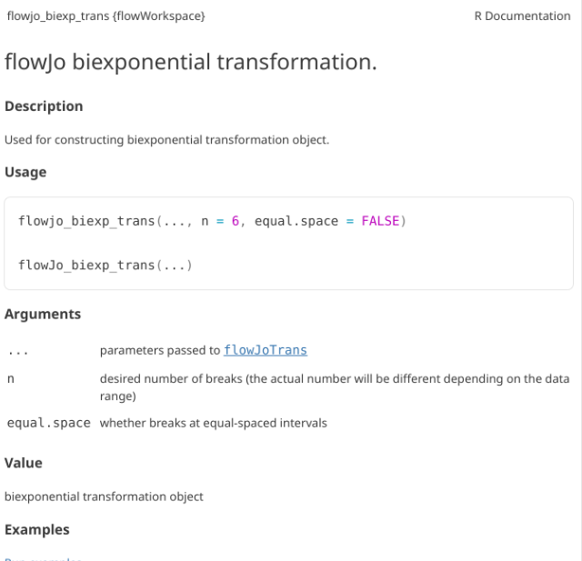
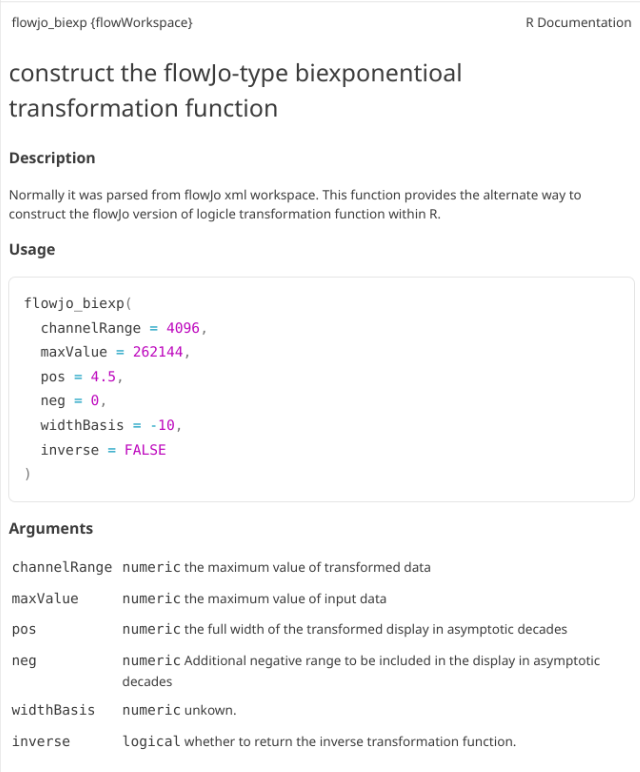
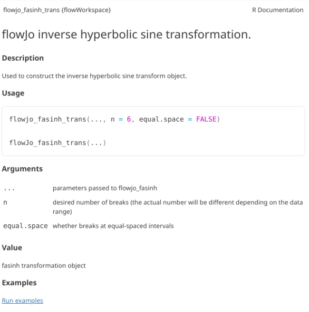
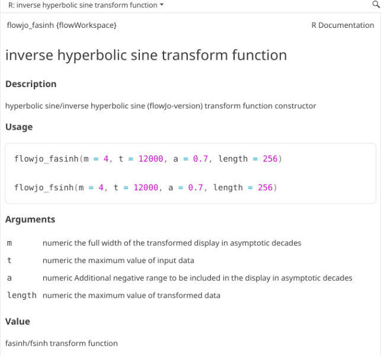
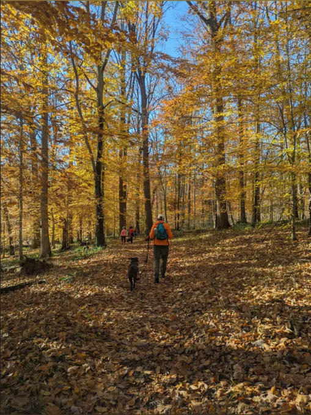

::: {style="text-align: right;"}
[](https://www.gnu.org/licenses/agpl-3.0.en.html) [](http://creativecommons.org/licenses/by-sa/4.0/)
:::

---

# Background

::: {.fragment}
::: {.callout-tip title="."}
Week 7: For this seventh session, we take a closer look at the raw values of the data within our .fcs files, and explore the various ways to transform (ie. scale) flow cytometry data in R to better visualize “positive” and “negative populations”. 
:::
:::

---

::: {.fragment}
::: {.callout-tip title="."}
There exist several commonly used transformations for Flow Cytometry data. Similarly, for Mass Cytometry data, the arsinh transformation is the most frequently applied. 
:::
:::

::: {.fragment}
::: {.callout-tip title="."}
Regardless of method, the goal remains to rescale the data in a way that allows for better interpretation. A misapplied transformation can be dangerous for an analysis, so don't just accept the default. Always ensure that what your transformed data visually makes sense. Similarly, this approach is shared in many of the exploratory data analsyis approaches we will encounter later on during the course. 
:::
:::

---

::: {.fragment}
::: {.callout-tip title="."}
Additionally, due to near perfect timing, Felix Marsh-Wakefield did a good overview of transformation for [CytoBites](https://www.youtube.com/watch?v=6jWLdZGbCH0) YouTube channel earlier this week that is worth checking out. 
:::
:::

---

# Walk Through

:::{.callout-important title="Housekeeping"}
As we do [every week](/course/02_FilePaths/index.qmd), on GitHub, [sync](/course/00_Homeworks/index.qmd#sync-your-fork) your forked version of the CytometryInR course to bring in the most recent updates. Then within Positron, [pull](/course/00_Homeworks/index.qmd#pull-to-local) in those changes to your local computer. 

After [setting up](/course/00_Git/index.qmd#new-folder-from-template) a "Week07" project folder, copy over the contents of "course/06_Visualizing/data" to that folder. This will hopefully prevent merge issues next week when attempting to pull in new course material. Once you have your new project folder organized, remember to [commit](/course/00_Git/index.qmd#push) and push your changes to GitHub to maintain remote version control. 

If you encounter issues syncing due to the Take-Home Problem merge conflict, see this [walkthrough](https://umgcccfcsr.github.io/CytometryInR/course/00_BonusContent/PullConflicts/). The updated homework submission protocol can be found [here](https://umgcccfcsr.github.io/CytometryInR/course/00_BonusContent/PullConflicts/UpdatedPullRequest)
:::

---

## Load Libraries

::: {.fragment}
::: {.callout-tip title="."}
This week, we will extensively be using the `flowWorkspace` package, as we learn how to build out our own `GatingSet` objects to include transformations. As we do so, we will need to visualize our underlying data, to ensure that the transformartions applied were correct for our datasets. Consequently, we will be using the `ggcyto` package extensively throughout the day. Therefore, it makes sense to go ahead and attach both packages to our local environment from the start. 
:::
:::

::: {.fragment}
```{r}
library(flowWorkspace)
library(ggcyto)
library(dplyr)
library(stringr)
```

:::

---

## Separating SFC and MC fcs files

::: {.fragment}
::: {.callout-tip title="."}
We will be using two cytometry datasets this week. For the [Spectral Flow Cytometry](https://www.immport.org/shared/study/SDY3080/summary) dataset, we will be re-using the 6 unmixed .fcs file first shared during [Week 05](/course/05_GatingSets/index.qmd). This time around, rather than bring them from a FlowJo.wsp into a GatingSet via the `CytoML` package, we will be building the GatingSet from scratch using the `flowWorkspace` package. These .fcs file names share the "2025" portion in the name, which we will use to filter them from the `list.files()` vector list. 
:::
:::

---

::: {.fragment}
::: {.callout-tip title="."}
For the Mass Cytometry dataset, we will be using 3 .fcs files that I retrieved from [ImmPort](https://www.immport.org/home) for the [Study SDY2739](https://www.immport.org/browser/?path=SDY2739&page=1) (Clinical Immunity to Malaria Involves Epigenetic Reprogramming of Innate Immune Cells). The .fcs file names for these files share the "G1_2" portion in the name, which we will use to filter them from the `list.files()` vector list. 
:::
:::

::: {.fragment}
```{r}
#StorageLocation <- file.path("course", "07_Transformations", "data") # When interactively writing the code 

StorageLocation <- file.path("data") #When Quarto Rendering

fcs_files <- list.files(StorageLocation, ".fcs", full.names=TRUE)
SFC_files <- fcs_files[stringr::str_detect(fcs_files, "2025")]
MC_files <- fcs_files[stringr::str_detect(fcs_files, "G1_2")]
```

:::

---

::: {.fragment}
::: {.callout-tip title="."}
Lets start by working with the SFC dataset. First off, let's double check that we have just the SFC files (as `flowWorkspace` will throw an error if the .fcs files passed contain different number of fluorophore/metal columns)
:::
:::

::: {.fragment}
```{r}
SFC_files
```

:::

---

::: {.fragment}
::: {.callout-tip title="."}
Circling back to where we left off during [Week 05](/course/05_GatingSets/), we will pass these file path locations to `load_cytoset_from_fcs()` to load them into a `GatingSet` object. 
:::
:::

::: {.fragment}
```{r}
SFC_cytoset <- load_cytoset_from_fcs(SFC_files, truncate_max_range = FALSE, transformation = FALSE)
SFC_GatingSet <- GatingSet(SFC_cytoset)

SFC_GatingSet
```

:::

---

### colnames

::: {.fragment}
::: {.callout-tip title="."}
When working with .fcs files that we have not worked with recently, it is often good to go ahead and check to see what fluorophores/markers are present at the start. This is also useful as different cytometer platforms have slightly different naming conventions. We can use `colnames()`
:::
:::

::: {.fragment}
```{r}
colnames(SFC_GatingSet)
```

:::

---

::: {.fragment}
::: {.callout-tip title="."}
As we can see from the output, most of the fluorophores have an "-A" appended to the end, although the FSC and SSC parameters feature area, height and width ("-A", "-H", "-W") respectively. 
:::
:::

---

### markernames

::: {.fragment}
::: {.callout-tip title="."}
If we wanted to retrieve the markers corresponding to the individual fluorophores, rather than attempting the breaking into the [S4 object](https://bioconductor.org/help/course-materials/2017/Zurich/S4-classes-and-methods.html) as we did during [Week 03](/course/03_InsideFCSFile/), we can take advantage of the `markernames()` function provided by the developers. 
:::
:::

::: {.fragment}
```{r}
markernames(SFC_GatingSet)
```

:::

---

### ggcyto

::: {.fragment}
::: {.callout-tip title="."}
At this point, we can then use what we have learned about the `ggcyto` package to make sure that the FSC x SSC plotting is working correctly. 
:::
:::

---

::: {.fragment}
```{r}
ggcyto(SFC_GatingSet[1], subset="root",
 aes(x="FSC-A", y="SSC-A")) + geom_hex(bins=100)
```

:::

---

::: {.fragment}
::: {.callout-tip title="."}
Please note, that for ggcyto it's just one set of [] after the GatingSet name to subset for plotting.
:::
:::

::: {.fragment}
```{r}
str(SFC_GatingSet[1])
```

:::

---

::: {.fragment}
::: {.callout-tip title="."}
By contrast, accidentally including two sets of [] would result in accidentally breaking into the S4 internals, and getting back a GatingHierarchy. 
:::
:::

::: {.fragment}
```{r}
str(SFC_GatingSet[[1]])
```

:::

---

### Untransformed Data

::: {.fragment}
::: {.callout-tip title="."}
Let's go ahead and plot a couple of the fluorophores, to see what untransformed data in R looks like
:::
:::

---

::: {.fragment}
```{r}
ggcyto(SFC_GatingSet[6], subset="root",
 aes(x="BUV805-A", y="BV650-A")) + geom_hex(bins=100)
```

:::

---

::: {.fragment}
::: {.callout-tip title="."}
As we can see, the scale currently appears linear, with a wide stretch of positive values for both CD4 and CD8 T cells. By contrast, you may remember the transformed version brought for this same .fcs file brought in from FlowJo via `CytoML` resembled the following
:::
:::

::: {.fragment}

:::

---

::: {.fragment}
::: {.callout-tip title="."}
If we use the `gh_get_transformations` function, we can see that there are currently no transformations applied to the GatingSet. 
:::
:::

::: {.fragment}
```{r}
gh_get_transformations(SFC_GatingSet[[1]])
```

:::

---

### Transformers

::: {.fragment}
::: {.callout-tip title="."}
`flowWorkspace` provides several default transforms (with the option to create your own). The functions in question return transformer objects, which are list that collect the required information for the transformations that are subsequently applied. 
:::
:::

::: {.fragment}
```{r}
Logicle <- logicle_trans()
str(Logicle)
```

:::

---

::: {.fragment}
```{r}
Biexponential <- flowjo_biexp_trans()
str(Biexponential)
```

:::

---

::: {.fragment}
```{r}
Asinh <- flowjo_fasinh_trans()
str(Asinh)
```

:::

---

::: {.fragment}
```{r}
AsinhGML <- asinhtGml2_trans()
str(AsinhGML)
```

:::

---

::: {.fragment}
::: {.callout-tip title="."}
As always, it can be worthwhile to first check the help documentation, to investigate the various arguments that can be used within the setup. 
:::
:::

---

### Column names to be transformed

::: {.fragment}
::: {.callout-tip title="."}
While having the transformation parameters is one component, the other is the fluorophores that are to be transformed. Recalling the `colnames()` function, we can see we have the following fluorophores for this panel. 
:::
:::

::: {.fragment}
```{r}
SFC_Parameters <- colnames(SFC_GatingSet)
SFC_Parameters
```

:::

---

::: {.fragment}
::: {.callout-tip title="."}
We will only need to apply transformations to fluorophores, not to FSC, SSC or Time parameters. We will therefore need to remove these from the list. One way would be to use [] index method, combining a ! and `stringr` `str_detect()` to remove for values that would be shared by those parameters
:::
:::

::: {.fragment}
```{r}
FluorophoresOnly <- SFC_Parameters[!stringr::str_detect(SFC_Parameters, "FSC|SSC|Time")]
FluorophoresOnly
```

:::

---

### transformerList

::: {.fragment}
::: {.callout-tip title="."}
Now that we have the fluorophore columns identified, using the `transformerList()` function we can combine them with the Transformer object we previously created. 
:::
:::

::: {.fragment}
```{r}
MyBiexTransform <- transformerList(FluorophoresOnly, Biexponential)
MyBiexTransform
```

:::

---

::: {.fragment}
```{r}
str(MyBiexTransform[1:3])
```

:::

---

::: {.fragment}
```{r}
str(MyBiexTransform$`APC-A`)
```

:::

---

::: {.fragment}
::: {.callout-tip title="."}
As you can notice, for each of the fluorophores we specified, the transformer object with the desired parameters has now been added as its own list entry. 
:::
:::

---

::: {.fragment}
::: {.callout-tip title="."}
The final step is to then apply it to the GatingSet
:::
:::

::: {.fragment}
```{r}
transform(SFC_GatingSet, MyBiexTransform)
```

:::

---

::: {.fragment}
::: {.callout-tip title="."}
If we now replot without having provided any arguments, we get the following:
:::
:::

::: {.fragment}
```{r}
ggcyto(SFC_GatingSet[6], subset="root",
 aes(x="BUV805-A", y="BV650-A")) + geom_hex(bins=100)
```

:::

---

::: {.fragment}
::: {.callout-tip title="."}
As we can see, applying a default transformation to a random .fcs file is not quite the way to go. We will need to look up some of the specific parameter arguments that need to be provided. Going back to our transformer function
:::
:::

::: {.fragment}
```{r}
#| eval: FALSE
?flowjo_biexp_trans
```

:::

---



---

::: {.fragment}
::: {.callout-tip title="."}
In this case, the help documentation doesn't provide much immediately. Part of this is that `flowjo_biexp_trans()` appears to be a wrapper function, which passes arguments on to the `flowJoTrans()` function. If we look this one up
:::
:::

::: {.fragment}
```{r}
#| eval: FALSE
?flowJoTrans
```

:::

---



---

::: {.fragment}
::: {.callout-tip title="."}

Under usage, we can see what the default options and arguments are. 

:::
:::

---


---

## Transformation Arguments

::: {.fragment}
::: {.callout-tip title="."}
Lets evaluate what effect changing each of these arguments in has on visualizing our .fcs file.
Our current visual is
:::
:::

---

```{r}
SFC_cytoset <- load_cytoset_from_fcs(SFC_files,
 truncate_max_range = FALSE, transformation = FALSE)
SFC_GatingSet <- GatingSet(SFC_cytoset)
Biexponential <- flowjo_biexp_trans(channelRange=4096, maxValue=262144,
     pos=4.5, neg=0, widthBasis=-10)
MyBiexTransform <- transformerList(FluorophoresOnly, Biexponential)
transform(SFC_GatingSet, MyBiexTransform)
```

---

```{r}
ggcyto(SFC_GatingSet[6], subset="root",
 aes(x="BUV805-A", y="BV650-A")) + geom_hex(bins=100)
```

---

::: {.fragment}
::: {.callout-tip title="."}
We will also need a way to validate whether they are being updated in the background. We can revisit the output of `gh_get_transformations()` function from earlier, and specify just the first specimen, and the BUV805 fluorophore
:::
:::

::: {.fragment}
```{r}
gh_get_transformations(SFC_GatingSet[[1]])$`BUV805-A`
```

:::

---

### width


::: {.fragment}
::: {.callout-tip title="."}
Before we go messing with any of the other setting, let's tackle width, which tends to be the one that gets missed by the default most often. Normally, in FlowJo most of my plots are set with biexponential transform width of around -1000, so lets go ahead and switch in that value. 
:::
:::

---

::: {.fragment}
```{r}
SFC_cytoset <- load_cytoset_from_fcs(SFC_files,
 truncate_max_range = FALSE, transformation = FALSE)
SFC_GatingSet <- GatingSet(SFC_cytoset)
Biexponential <- flowjo_biexp_trans(channelRange=4096, maxValue=262144,
     pos=4.5, neg=0, widthBasis=-1000)
MyBiexTransform <- transformerList(FluorophoresOnly, Biexponential)
transform(SFC_GatingSet, MyBiexTransform)
```

:::

---

```{r}
ggcyto(SFC_GatingSet[6], subset="root",
 aes(x="BUV805-A", y="BV650-A")) + geom_hex(bins=100)
```

---


::: {.fragment}
::: {.callout-tip title="."}
Boom! That is more in line with what we were looking for. Let's still check a couple other values. 
:::
:::

---


::: {.fragment}
```{r}
SFC_cytoset <- load_cytoset_from_fcs(SFC_files,
 truncate_max_range = FALSE, transformation = FALSE)
SFC_GatingSet <- GatingSet(SFC_cytoset)
Biexponential <- flowjo_biexp_trans(channelRange=4096, maxValue=262144,
     pos=4.5, neg=0, widthBasis=-500)
MyBiexTransform <- transformerList(FluorophoresOnly, Biexponential)
transform(SFC_GatingSet, MyBiexTransform)
```

:::

---

```{r}
ggcyto(SFC_GatingSet[6], subset="root",
 aes(x="BUV805-A", y="BV650-A")) + geom_hex(bins=100)
```

---

::: {.fragment}
::: {.callout-tip title="."}
A width value of -500 still has the negavite population relative condensed, with the CD4+ cells into a more circular format. Lets try -100 next
:::
:::

---

::: {.fragment}
```{r}
SFC_cytoset <- load_cytoset_from_fcs(SFC_files,
 truncate_max_range = FALSE, transformation = FALSE)
SFC_GatingSet <- GatingSet(SFC_cytoset)
Biexponential <- flowjo_biexp_trans(channelRange=4096, maxValue=262144,
     pos=4.5, neg=0, widthBasis=-100)
MyBiexTransform <- transformerList(FluorophoresOnly, Biexponential)
transform(SFC_GatingSet, MyBiexTransform)
```

:::

---

```{r}
ggcyto(SFC_GatingSet[6], subset="root",
 aes(x="BUV805-A", y="BV650-A")) + geom_hex(bins=100)
```

---

::: {.fragment}
::: {.callout-tip title="."}
And nope, too far. Let's keep -500 for now. 
:::
:::

---

### channelRange

::: {.fragment}
::: {.callout-tip title="."}
Now that width is set closer to what we would expect, lets alter the next couple arguments and see if they have any effect. The argument channelRange is currently set for 4096. Lets double it
:::
::: 

::: {.fragment}
```{r}
SFC_cytoset <- load_cytoset_from_fcs(SFC_files,
 truncate_max_range = FALSE, transformation = FALSE)
SFC_GatingSet <- GatingSet(SFC_cytoset)
Biexponential <- flowjo_biexp_trans(channelRange=8192, maxValue=262144,
     pos=4.5, neg=0, widthBasis=-500)
MyBiexTransform <- transformerList(FluorophoresOnly, Biexponential)
transform(SFC_GatingSet, MyBiexTransform)
```

:::

---

```{r}
ggcyto(SFC_GatingSet[6], subset="root",
 aes(x="BUV805-A", y="BV650-A")) + geom_hex(bins=100)
```

---

::: {.fragment}
```{r}
gh_get_transformations(SFC_GatingSet[[1]])$`BUV805-A`
```

:::


---

::: {.fragment}
::: {.callout-tip title="."}
Not much apparent change, so lets go the opposite direction and reduce the original value by half. 

:::
:::

---

::: {.fragment}
```{r}
SFC_cytoset <- load_cytoset_from_fcs(SFC_files,
 truncate_max_range = FALSE, transformation = FALSE)
SFC_GatingSet <- GatingSet(SFC_cytoset)
Biexponential <- flowjo_biexp_trans(channelRange=2048, maxValue=262144,
     pos=4.5, neg=0, widthBasis=-500)
MyBiexTransform <- transformerList(FluorophoresOnly, Biexponential)
transform(SFC_GatingSet, MyBiexTransform)
```

:::

---


```{r}
ggcyto(SFC_GatingSet[6], subset="root",
 aes(x="BUV805-A", y="BV650-A")) + geom_hex(bins=100)
```

---

::: {.fragment}
```{r}
gh_get_transformations(SFC_GatingSet[[1]])$`BUV805-A`
```

:::

---

::: {.fragment}
::: {.callout-tip title="."}
Few minor changes, but not much otherwise. So lets proceed on to the next argument!
:::
:::

---

### maxValue

::: {.fragment}
::: {.callout-tip title="."}
Same procedure, the current maxValue is 262144, lets double it and see what happens!
:::
:::

::: {.fragment}
```{r}
SFC_cytoset <- load_cytoset_from_fcs(SFC_files,
 truncate_max_range = FALSE, transformation = FALSE)
SFC_GatingSet <- GatingSet(SFC_cytoset)
Biexponential <- flowjo_biexp_trans(channelRange=4096, maxValue=524288,
     pos=4.5, neg=0, widthBasis=-500)
MyBiexTransform <- transformerList(FluorophoresOnly, Biexponential)
transform(SFC_GatingSet, MyBiexTransform)
```

:::

---

```{r}
ggcyto(SFC_GatingSet[6], subset="root",
 aes(x="BUV805-A", y="BV650-A")) + geom_hex(bins=100)
```

---

::: {.fragment}
::: {.callout-tip title="."}
You will notice, that when we doubled the maxValue, we are phenocopying the result we got when we had width set to -1000, with the CD4 population. This is worth noting. Lets now try instead to reduce it!
:::
:::

---

::: {.fragment}
```{r}
SFC_cytoset <- load_cytoset_from_fcs(SFC_files,
 truncate_max_range = FALSE, transformation = FALSE)
SFC_GatingSet <- GatingSet(SFC_cytoset)
Biexponential <- flowjo_biexp_trans(channelRange=4096, maxValue=131072,
     pos=4.5, neg=0, widthBasis=-500)
MyBiexTransform <- transformerList(FluorophoresOnly, Biexponential)
transform(SFC_GatingSet, MyBiexTransform)
```

:::

---

```{r}
ggcyto(SFC_GatingSet[6], subset="root",
 aes(x="BUV805-A", y="BV650-A")) + geom_hex(bins=100)
```

---

::: {.fragment}
::: {.callout-tip title="."}
And likewise, we are going the opposite to our intended effect. As maxValue can in part be determined by our instrument settings (as well as individual fluorophores), this is an argument we should keep an eye on. Let's leave it at its current default for now. 
:::
:::

---

### pos

::: {.fragment}
::: {.callout-tip title="."}
The next argument pos corresponds to the number of positive decades. It is currently set at 4.5
:::
:::

::: {.fragment}
```{r}
SFC_cytoset <- load_cytoset_from_fcs(SFC_files,
 truncate_max_range = FALSE, transformation = FALSE)
SFC_GatingSet <- GatingSet(SFC_cytoset)
Biexponential <- flowjo_biexp_trans(channelRange=4096, maxValue=262144,
     pos=4.5, neg=0, widthBasis=-500)
MyBiexTransform <- transformerList(FluorophoresOnly, Biexponential)
transform(SFC_GatingSet, MyBiexTransform)
```

:::

---

```{r}
ggcyto(SFC_GatingSet[6], subset="root",
 aes(x="BUV805-A", y="BV650-A")) + geom_hex(bins=100)
```

---

::: {.fragment}
::: {.callout-tip title="."}
Although this can be increased on some instrument settings. Let's walk it up to 5!
:::
:::

::: {.fragment}
```{r}
SFC_cytoset <- load_cytoset_from_fcs(SFC_files,
 truncate_max_range = FALSE, transformation = FALSE)
SFC_GatingSet <- GatingSet(SFC_cytoset)
Biexponential <- flowjo_biexp_trans(channelRange=4096, maxValue=262144,
     pos=5, neg=0, widthBasis=-500)
MyBiexTransform <- transformerList(FluorophoresOnly, Biexponential)
transform(SFC_GatingSet, MyBiexTransform)
```

:::

---

```{r}
ggcyto(SFC_GatingSet[6], subset="root",
 aes(x="BUV805-A", y="BV650-A")) + geom_hex(bins=100)
```

---

::: {.fragment}
::: {.callout-tip title="."}
And on first glance no. If we had our settings for 5 positive decades, we would need to adjust both the maxValue and widthBasis to return to a closer to expected shape. 
:::
:::

::: {.fragment}
```{r}
SFC_cytoset <- load_cytoset_from_fcs(SFC_files,
 truncate_max_range = FALSE, transformation = FALSE)
SFC_GatingSet <- GatingSet(SFC_cytoset)
Biexponential <- flowjo_biexp_trans(channelRange=4096, maxValue=524288,
     pos=5, neg=0, widthBasis=-1000)
MyBiexTransform <- transformerList(FluorophoresOnly, Biexponential)
transform(SFC_GatingSet, MyBiexTransform)
```

:::

---

```{r}
ggcyto(SFC_GatingSet[6], subset="root",
 aes(x="BUV805-A", y="BV650-A")) + geom_hex(bins=100)
```

---

### neg

::: {.fragment}
::: {.callout-tip title="."}
We have a similar story for adding negative decades. 
:::
:::

::: {.fragment}
```{r}
SFC_cytoset <- load_cytoset_from_fcs(SFC_files,
 truncate_max_range = FALSE, transformation = FALSE)
SFC_GatingSet <- GatingSet(SFC_cytoset)
Biexponential <- flowjo_biexp_trans(channelRange=4096, maxValue=262144,
     pos=4.5, neg=0, widthBasis=-500)
MyBiexTransform <- transformerList(FluorophoresOnly, Biexponential)
transform(SFC_GatingSet, MyBiexTransform)
```

:::

---

```{r}
ggcyto(SFC_GatingSet[6], subset="root",
 aes(x="BUV805-A", y="BV650-A")) + geom_hex(bins=100)
```

---

::: {.fragment}
::: {.callout-tip title="."}
Adding an extra negative decade doesn't seem to noticiblt affect these two fluorophores. 
:::
:::

::: {.fragment}
```{r}
SFC_cytoset <- load_cytoset_from_fcs(SFC_files,
 truncate_max_range = FALSE, transformation = FALSE)
SFC_GatingSet <- GatingSet(SFC_cytoset)
Biexponential <- flowjo_biexp_trans(channelRange=4096, maxValue=262144,
     pos=4.5, neg=1, widthBasis=-500)
MyBiexTransform <- transformerList(FluorophoresOnly, Biexponential)
transform(SFC_GatingSet, MyBiexTransform)
```

:::

---

```{r}
ggcyto(SFC_GatingSet[6], subset="root",
 aes(x="BUV805-A", y="BV650-A")) + geom_hex(bins=100)
```

---

::: {.fragment}
::: {.callout-tip title="."}
It is only when we increase to 2 (i.e. -2 decades) that we start to see a spreading effect.
:::
:::

::: {.fragment}
```{r}
SFC_cytoset <- load_cytoset_from_fcs(SFC_files,
 truncate_max_range = FALSE, transformation = FALSE)
SFC_GatingSet <- GatingSet(SFC_cytoset)
Biexponential <- flowjo_biexp_trans(channelRange=4096, maxValue=262144,
     pos=4.5, neg=2, widthBasis=-500)
MyBiexTransform <- transformerList(FluorophoresOnly, Biexponential)
transform(SFC_GatingSet, MyBiexTransform)
```

:::

---

```{r}
ggcyto(SFC_GatingSet[6], subset="root",
 aes(x="BUV805-A", y="BV650-A")) + geom_hex(bins=100)
```

---

### Recap

::: {.fragment}
::: {.callout-tip title="."}
We have looked at how the various arguments can affect the overall visualization, and seen how some of these are interconnected. It might be worthwhile to verify what your own instrument settings are at first (especially in context of maxValue and positive decades), and then use these when starting in R for the first time. 
:::
:::

---

## MC

::: {.fragment}
::: {.callout-tip title="."}
Having now had some experience applying transformations to SFC data, let's turn and look at how to apply arsinh to our mass cytometry (CyTOF) dataset. Lets once again make sure we have the correct .fcs files
:::
:::

::: {.fragment}
```{r}
MC_files
```

:::

---

::: {.fragment}
::: {.callout-tip title="."}
And modify the steps from [Week 05](/course/05_GatingSets/) to load them into a `GatingSet` object. 
:::
:::

::: {.fragment}
```{r}
MC_cytoset <- load_cytoset_from_fcs(MC_files, truncate_max_range = FALSE, transformation = FALSE)
MC_GatingSet <- GatingSet(MC_cytoset)

MC_GatingSet
```

:::

---

::: {.fragment}
::: {.callout-tip title="."}
Let's examine the names for the metal tags
:::
:::

::: {.fragment}
```{r}
colnames(MC_GatingSet)
```

:::

---

::: {.fragment}
::: {.callout-tip title="."}
And the corresponding markers associated with each
:::
:::

::: {.fragment}
```{r}
markernames(MC_GatingSet)
```

:::

---

::: {.fragment}
::: {.callout-tip title="."}
And lets go ahead and visualize the CD4 x CD8 plot for the first specimen. 
:::
:::

---

::: {.fragment}
```{r}
ggcyto(MC_GatingSet[1], subset="root",
 aes( x="Nd145Di", y="Nd146Di")) + geom_hex(bins=100)
```

:::
---

::: {.fragment}
::: {.callout-tip title="."}
We can then select the particular markers we are interested, that we want to end up transforming. For this example, lets say we wanted to remove the multiple Barcode and Beads entries

:::
:::

::: {.fragment}
```{r}
MC_Parameters <- markernames(MC_GatingSet)
MC_MarkersInterest <- MC_Parameters[!str_detect("Barcode|Beads", MC_Parameters)]
MC_MarkersInterest
```

:::

---

::: {.fragment}
::: {.callout-tip title="."}
Of which, we want the names for this named list. So....
:::
:::

::: {.fragment}
```{r}
InterestingMetalsOnly <- names(MC_MarkersInterest)
InterestingMetalsOnly
```

:::

---

::: {.fragment}
::: {.callout-tip title="."}
With these, we can then combine them with our transformer of interest to create the `transformerList()` that we can then apply to the samples. 
:::
:::

::: {.fragment}
```{r}
Asinh <- flowjo_fasinh_trans()
MyAsinhTransform <- transformerList(InterestingMetalsOnly, Asinh)
str(MyAsinhTransform[1:3])
```

:::

---

::: {.fragment}
```{r}
transform(MC_GatingSet, MyAsinhTransform)
```

:::

---

::: {.fragment}
::: {.callout-tip title="."}
With this done, let's try replotting the previous CD4 by CD8 plot
:::
:::

::: {.fragment}
```{r}
ggcyto(MC_GatingSet[1], subset="root",
 aes( x="Nd145Di", y="Nd146Di")) + geom_hex(bins=100)
```

:::

---

### Asinh Arguments

::: {.fragment}
::: {.callout-tip title="."}
Similar to the case with SFC, we may need to revise some of the values provided to the individual arguments. Lets similarly investigate what we can do
:::
:::

::: {.fragment}
```{r}
#| eval: FALSE
?flowjo_fasinh_trans
```

:::

---



---

::: {.fragment}
::: {.callout-tip title="."}
Which turns out to be another wrapper. Lets try the similarly named function
:::
:::

::: {.fragment}
```{r}
#| eval: FALSE
?flowjo_fasinh
```

:::

---



---

::: {.fragment}
::: {.callout-tip title="."}
As we may remember, our current setting are the following
:::
:::

::: {.fragment}
```{r}
MC_cytoset <- load_cytoset_from_fcs(MC_files,
 truncate_max_range = FALSE, transformation = FALSE)
MC_GatingSet <- GatingSet(MC_cytoset)
Asinh <- flowjo_fasinh_trans(m = 4, t = 12000, a = 0.7, length = 256)
MyAsinhTransform <- transformerList(InterestingMetalsOnly, Asinh)
transform(MC_GatingSet, MyAsinhTransform)
```

:::

---

```{r}
ggcyto(MC_GatingSet[1], subset="root",
 aes( x="Nd145Di", y="Nd146Di")) + geom_hex(bins=100)
```

---

::: {.fragment}
```{r}
gh_get_transformations(MC_GatingSet[[1]])$`Nd145Di`
```

:::

---

#### m 

::: {.fragment}
::: {.callout-tip title="."}
Being completionist, lets change the MC arguments as well. M is width in asymptotic decades, currently set to 4.
:::
:::

::: {.fragment}
```{r}
MC_cytoset <- load_cytoset_from_fcs(MC_files,
 truncate_max_range = FALSE, transformation = FALSE)
MC_GatingSet <- GatingSet(MC_cytoset)
Asinh <- flowjo_fasinh_trans(m = 4, t = 12000, a = 0.7, length = 256)
MyAsinhTransform <- transformerList(InterestingMetalsOnly, Asinh)
transform(MC_GatingSet, MyAsinhTransform)
```

:::

---

```{r}
ggcyto(MC_GatingSet[1], subset="root",
 aes( x="Nd145Di", y="Nd146Di")) + geom_hex(bins=100)
```

---

::: {.fragment}
::: {.callout-tip title="."}
Lets set it to 5!
:::
:::

::: {.fragment}
```{r}
MC_cytoset <- load_cytoset_from_fcs(MC_files,
 truncate_max_range = FALSE, transformation = FALSE)
MC_GatingSet <- GatingSet(MC_cytoset)
Asinh <- flowjo_fasinh_trans(m = 5, t = 12000, a = 0.7, length = 256)
MyAsinhTransform <- transformerList(InterestingMetalsOnly, Asinh)
transform(MC_GatingSet, MyAsinhTransform)
```

:::

---

```{r}
ggcyto(MC_GatingSet[1], subset="root",
 aes( x="Nd145Di", y="Nd146Di")) + geom_hex(bins=100)
```

---

::: {.fragment}
::: {.callout-tip title="."}
Vs. when we set it to 3
:::
:::

::: {.fragment}
```{r}
MC_cytoset <- load_cytoset_from_fcs(MC_files,
 truncate_max_range = FALSE, transformation = FALSE)
MC_GatingSet <- GatingSet(MC_cytoset)
Asinh <- flowjo_fasinh_trans(m = 3, t = 12000, a = 0.7, length = 256)
MyAsinhTransform <- transformerList(InterestingMetalsOnly, Asinh)
transform(MC_GatingSet, MyAsinhTransform)
```

:::

---

```{r}
ggcyto(MC_GatingSet[1], subset="root",
 aes( x="Nd145Di", y="Nd146Di")) + geom_hex(bins=100)
```

---

### t

::: {.fragment}
::: {.callout-tip title="."}
Increase t to 24000
:::
:::

::: {.fragment}
```{r}
MC_cytoset <- load_cytoset_from_fcs(MC_files,
 truncate_max_range = FALSE, transformation = FALSE)
MC_GatingSet <- GatingSet(MC_cytoset)
Asinh <- flowjo_fasinh_trans(m = 4, t = 24000, a = 0.7, length = 256)
MyAsinhTransform <- transformerList(InterestingMetalsOnly, Asinh)
transform(MC_GatingSet, MyAsinhTransform)
```

:::

---

```{r}
ggcyto(MC_GatingSet[1], subset="root",
 aes( x="Nd145Di", y="Nd146Di")) + geom_hex(bins=100)
```


---

::: {.fragment}
::: {.callout-tip title="."}
Decrease t to 6000
:::
:::

::: {.fragment}
```{r}
MC_cytoset <- load_cytoset_from_fcs(MC_files,
 truncate_max_range = FALSE, transformation = FALSE)
MC_GatingSet <- GatingSet(MC_cytoset)
Asinh <- flowjo_fasinh_trans(m = 4, t = 6000, a = 0.7, length = 256)
MyAsinhTransform <- transformerList(InterestingMetalsOnly, Asinh)
transform(MC_GatingSet, MyAsinhTransform)
```

:::

---

```{r}
ggcyto(MC_GatingSet[1], subset="root",
 aes( x="Nd145Di", y="Nd146Di")) + geom_hex(bins=100)
```


---

### a

::: {.fragment}
::: {.callout-tip title="."}
Increase negative decade to 1
:::
:::

::: {.fragment}
```{r}
MC_cytoset <- load_cytoset_from_fcs(MC_files,
 truncate_max_range = FALSE, transformation = FALSE)
MC_GatingSet <- GatingSet(MC_cytoset)
Asinh <- flowjo_fasinh_trans(m = 4, t = 12000, a = 1, length = 256)
MyAsinhTransform <- transformerList(InterestingMetalsOnly, Asinh)
transform(MC_GatingSet, MyAsinhTransform)
```

:::

---

```{r}
ggcyto(MC_GatingSet[1], subset="root",
 aes( x="Nd145Di", y="Nd146Di")) + geom_hex(bins=100)
```


---

::: {.fragment}
::: {.callout-tip title="."}
Vs. set to 0
:::
:::

::: {.fragment}
```{r}
MC_cytoset <- load_cytoset_from_fcs(MC_files,
 truncate_max_range = FALSE, transformation = FALSE)
MC_GatingSet <- GatingSet(MC_cytoset)
Asinh <- flowjo_fasinh_trans(m = 4, t = 12000, a = 0, length = 256)
MyAsinhTransform <- transformerList(InterestingMetalsOnly, Asinh)
transform(MC_GatingSet, MyAsinhTransform)
```

:::

---

```{r}
ggcyto(MC_GatingSet[1], subset="root",
 aes( x="Nd145Di", y="Nd146Di")) + geom_hex(bins=100)
```


---

### length

::: {.fragment}
::: {.callout-tip title="."}
Doubling numeric max value of transformed data to 512
:::
:::

::: {.fragment}
```{r}
MC_cytoset <- load_cytoset_from_fcs(MC_files,
 truncate_max_range = FALSE, transformation = FALSE)
MC_GatingSet <- GatingSet(MC_cytoset)
Asinh <- flowjo_fasinh_trans(m = 4, t = 12000, a = 1, length = 512)
MyAsinhTransform <- transformerList(InterestingMetalsOnly, Asinh)
transform(MC_GatingSet, MyAsinhTransform)
```

:::

---

```{r}
ggcyto(MC_GatingSet[1], subset="root",
 aes( x="Nd145Di", y="Nd146Di")) + geom_hex(bins=100)
```

---

::: {.fragment}
::: {.callout-tip title="."}
Vs. reducing it to 128
:::
:::

::: {.fragment}
```{r}
MC_cytoset <- load_cytoset_from_fcs(MC_files,
 truncate_max_range = FALSE, transformation = FALSE)
MC_GatingSet <- GatingSet(MC_cytoset)
Asinh <- flowjo_fasinh_trans(m = 4, t = 12000, a = 1, length = 128)
MyAsinhTransform <- transformerList(InterestingMetalsOnly, Asinh)
transform(MC_GatingSet, MyAsinhTransform)
```

:::

---

```{r}
ggcyto(MC_GatingSet[1], subset="root",
 aes( x="Nd145Di", y="Nd146Di")) + geom_hex(bins=100)
```

---

## Extracting Data

::: {.fragment}
::: {.callout-tip title="."}
One area where we will separately need to remember whether a transformation is applied or not is later on in the course, when we are trying to extract out the underlying exprs data for use in downstream analysis. If we wanted to do this for our current GatingSet, we first need to fetch the pointer contents to return a CytoSet object. 
:::
:::

::: {.fragment}
```{r}
MyCytoSet <- gs_pop_get_data(SFC_GatingSet[[1]], "root")
MyCytoSet
```

:::

---

::: {.fragment}
::: {.callout-tip title="."}
We can then extract our the underlying MFI data using the `exprs()` function.
:::
:::

::: {.fragment}
```{r}
exprs(MyCytoSet[[1]])[1:3,]
```

:::

---

::: {.fragment}
::: {.callout-tip title="."}
If you look at the data for a while, you may notice the MFI values seem abnormally abbreviated. This is because the values present were themselves transformed. If we had wanted to retrieve the raw, untransformed values, we would have needed to provide the inverse.transform = TRUE argument when fetching the CytoSet. This would have trigerred the inverse.transformation stored within the transformerList, reverting values back to the original. 
:::
:::

::: {.fragment}
```{r}
MyInversedCytoSet <- gs_pop_get_data(SFC_GatingSet[[1]], "root", inverse.transform=TRUE)
exprs(MyInversedCytoSet[[1]])[1:3,]
```

:::

---

::: {.fragment}
::: {.callout-tip title="."}
Right now, this won't affect much, but we will encounter where this matters in a couple weeks when we discuss how to visualize [fluorescent signatures](), and their subsequent use in unmixing.
:::
::: 

---

# Take Away

::: {.fragment}
::: {.callout-tip title="."}
This week, we looked at how to set up our underlying data for transformation within the `flowWorkspace` context, providing the transform and column names of interest to create a `transformerList`, and then applying it to our GatingSet. We also investigated how to visualize our data and provide additional arguments to ensure that we are optimally transforming the data rather than accepting the default options. 
:::
:::

---

::: {.fragment}
::: {.callout-tip title="."}
As cytometry instrument platforms will often vary on their range settings, the parameter argument values we used for this particular visualization may not be applicable to your own dataset, so you may need to tinker with your own .fcs files to ensure that you are visualizing the underlying data properly, depending on what you are doing (whether supervised manual analysis, or more unsupervised algorithmic style analysis). 
:::
:::

---

::: {.fragment}
::: {.callout-tip title="."}
Next week, we will have no class (I will be presenting at the [ABRF]() conference). I had to split this weeks combined Transformation/Compensation lesson into two separate parts, I am still deciding whether to have compensation be a separate stand-alone bonus class (given primary audience is those doing conventional flow cytometry) or to push it into the current rotation ahead of [manual and automated gating](). I will let you know once I figure it out. 
:::
:::

---

::: {.fragment}
::: {.callout-tip title="."}
Also, as a heads up, I will be sending out the first class feedback survey. This is our first year doing this course, and any feedback you can provide will help make sure we address any areas that we are falling short to make things better both for those currently taking the course, as well as those who may follow later. 
:::
:::

---



---

# Additional Resources

[flowWorkspace Bioconductor Vignette](https://www.bioconductor.org/packages/devel/bioc/vignettes/flowWorkspace/inst/doc/flowWorkspace-Introduction.html#04_Build_the_GatingSet_from_scratch)

[FlowJo Data Transformation](https://docs.flowjo.com/flowjo/graphs-and-gating/gw-transform-overview/)

[Optimizing transformations for automated, high throughput analysis of flow cytometry data](https://pmc.ncbi.nlm.nih.gov/articles/PMC3243046/)

[Spectre: Data Transformation](https://immunedynamics.io/Spectre/articles/data_transformation.html)

[Colibri Cytometry: Scaling your Data for Dimensionality Reduction](https://www.colibri-cytometry.com/post/data-analysis-scaling-your-data-for-dimensionality-reduction)

[CytoBites: Why do we transform Cytometry Data](https://www.youtube.com/watch?v=6jWLdZGbCH0)

[CyTOF data analysis](https://med.stanford.edu/iti/himc/immune-monitoring-virtual-course-2020/part-3.html)

---

# Take-home Problems

:::{.callout-tip title="Problem 1"}
We had not selected FSC and SSC parameters in this attempt, as they are normally displayed in the linear scale. Include them in the list of fluorophores to be transformed, and see how this impacts the visualization (imitating what could accidentally happen in practice if they were left in)
:::

---

:::{.callout-tip title="Problem 2"}
For the SFC data, I showed the setup for both Logicle and Biexponential, but didn't have time to dive into the Logicle transformation. Select a couple markers of interest for the SFC data, visualize and screenshot the before, and then attempt to customize the biexponential arguments to best visualize the underlying data, and then repeat for Logicle. Take screenshots of both and compare/contrast the difference. 
:::

---

:::{.callout-tip title="Problem 3"}
There are to asinh style transformations provided by the `flowWorkspace` package. Using the mass cytometry data, select two metal markers of interest, visualize each, customize the arguments until you have properly visualized the underlying populations, and see if you can spot any major differences between the methods.  
:::

---


::: {style="text-align: right;"}
[](https://www.gnu.org/licenses/agpl-3.0.en.html) [](http://creativecommons.org/licenses/by-sa/4.0/)
:::