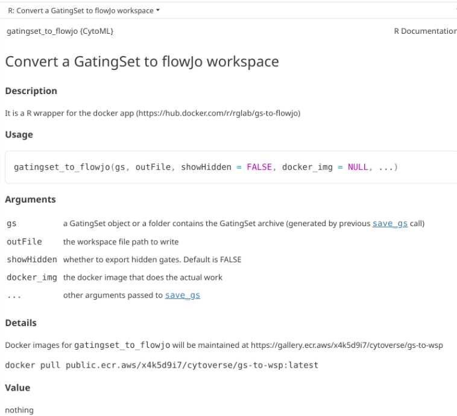
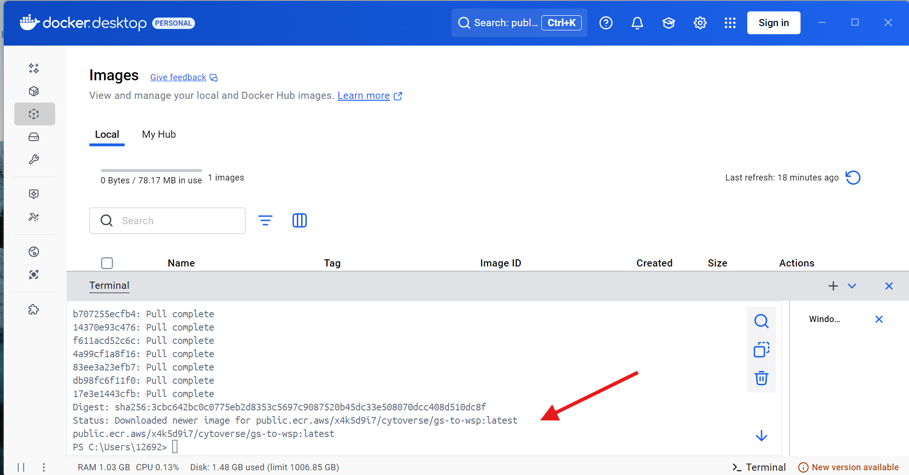
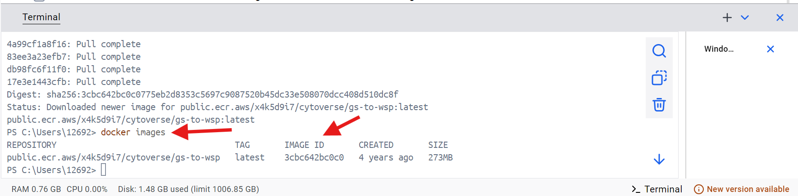
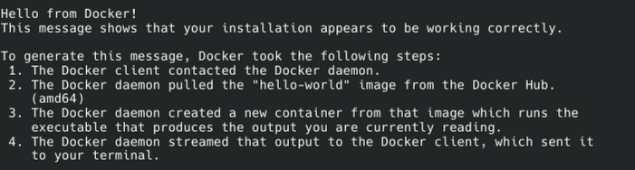
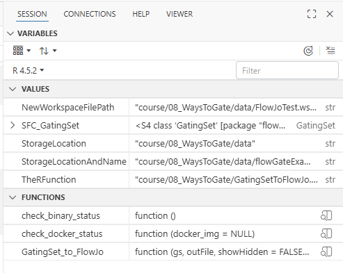
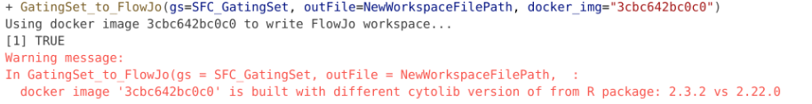
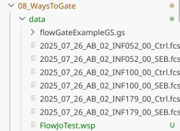
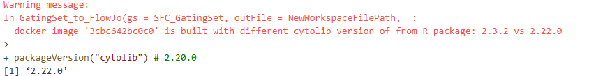
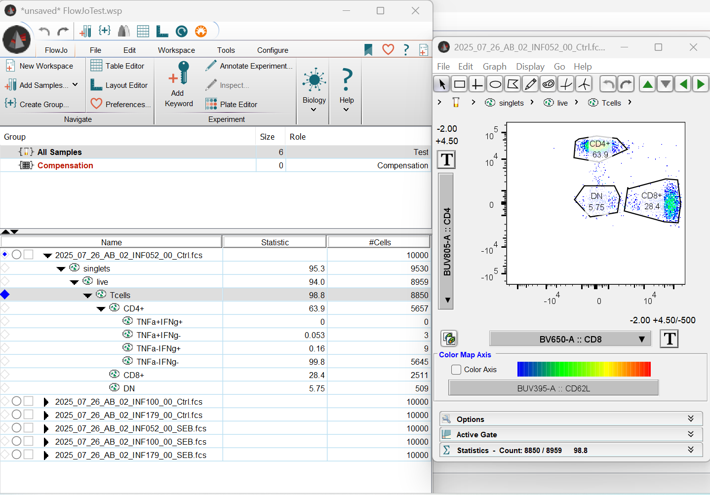

::: {style="text-align: right;"}
[](https://www.gnu.org/licenses/agpl-3.0.en.html) [](http://creativecommons.org/licenses/by-sa/4.0/)
:::

<br>

---
 
# Overview 

As we saw during [Week 05](/course/05_GatingSets/index.qmd), we were able to bring FlowJo .wsp files directly into GatingSet objects via the `CytoML` package. The opposite is also true, and we can convert our GatingSet objects from R into FlowJo .wsp that can be shared with a collaborator. This can be especially helpful starting on [Week 08](/course/08_WaysToGate/index.qmd), when we start creating GatingSets with manual and automated gates, that we may want to save for later. 

The main challenge, is that the current implementation is underdocumented, and relies on an old Cytoverse [Docker](https://www.docker.com/) container originally provided by [Ozette](https://ozette.com/) as part of the [CytoML](https://www.bioconductor.org/packages/release/bioc/html/CytoML.html) R package. [Docker](https://www.docker.com/) is a software that will containerize everything that is needed to run something (in this particular case, an .exe file). However, the current Docker image has not been updated recently, which alongside the lack of documentation makes the implementation tricky. 

Likewise, installing Docker can be its own can of worms, especially from a IT safety side, so if your IT department was giving you hassles over Positron, Quarto or Git, then it is unlikely to happen. 

Consequently, this walk-through of the process is for anyone who is on their own computer and might be interested in this extended functionality to the `CytoML` package.

# Docker Setup

To be able to convert a GatingSet to a FlowJo workspace using the `CytoML` package, you will need to have [Docker](https://www.docker.com/) correctly set up on your computer (with proper permissions, etc), and have downloaded the Cytoverse container that contains the .exe file needed for the conversion step. 

Please note, Docker can be its own can of IT worms, so I am assuming you are installing it on your own computer, or have your IT-departments blessing to proceed in a limited capacity. 

There are two general ways that you can install Docker, one via Docker Desktop (more graphical-user interface (GUI) elements, available for Windows, MacOS, and Linux) or via Docker Engine (more command-line interface (CLI), typically for Linux). We will showcase a representative installation process for both below, before reconvening on the conversion steps once back to Positron and R. 

## Docker Desktop - Windows

This is the typical setup for Docker Desktop. In the case of this documentation, it was done on a Windows Operating System, but you would see something similar for both MacOS and Linux. 

The first step is to go ahead and download [Docker Desktop](https://docs.docker.com/desktop/) and proceed through the installation.

Once the installation is complete, proceed to open Docker Desktop, and proceed to skip the account creation (unless you plan to use it extensively).  


Once you are within DockerDesktop, go ahead and click on the terminal tab on the lower right. 


You will then be asked to enable the Docker terminal so that it can communicate with your operating system's terminal (PowerShell, since we are using a Windows computer for this example).


Once enabled, the terminal will be live. 


The link to the currently working (as of April 2026) is documented within the CytoML help documentation for the `gatingset_to_flowjo()` function

```{r}
#| eval: FALSE
library(CytoML)
?gatingset_to_flowjo
```



Go ahead and copy and paste this line of code into the Docker terminal, then press Enter. 
```{bash}
#| eval: FALSE
docker pull public.ecr.aws/x4k5d9i7/cytoverse/gs-to-wsp:latest
```


It will then proceed to download the Docker contained, when successful you will see the an output similar to this one in your terminal window. 



Next, run the following line of code within the Docker terminal, and copy the "IMAGE ID" number, as you will need it later. 

```{bash}
#| eval: FALSE
docker images
```



With this done, return to Positron and continue with the walk-through. 

## Docker Engine - Debian Linux

This is the setup process for Docker Engine (more command-line interface (CLI), typically for Linux Operating Systems). In the context of this walkthrough, we were installing for Debian Linux (Trixie) distro. For installation instructions for other distros, please consult [here](https://docs.docker.com/engine/install/). The original instructions for Debian can be found [here](https://docs.docker.com/engine/install/debian/#install-using-the-repository). 

The first step for Debian is via our terminal to add Docker to the apt repositories to be able to pull updates. 

```{bash}
#| eval: FALSE

# Set up Docker apt repository
sudo apt update
sudo apt install ca-certificates curl
sudo install -m 0755 -d /etc/apt/keyrings
sudo curl -fsSL https://download.docker.com/linux/debian/gpg -o /etc/apt/keyrings/docker.asc
sudo chmod a+r /etc/apt/keyrings/docker.asc

# Add repository to apt sources
sudo tee /etc/apt/sources.list.d/docker.sources <<EOF
Types: deb
URIs: https://download.docker.com/linux/debian
Suites: $(. /etc/os-release && echo "$VERSION_CODENAME")
Components: stable
Architectures: $(dpkg --print-architecture)
Signed-By: /etc/apt/keyrings/docker.asc
EOF
sudo apt update
```

Once this is done, we can proceed to install Docker. 

```{bash}
#| eval: FALSE

sudo apt install docker-ce docker-ce-cli containerd.io docker-buildx-plugin docker-compose-plugin
```

Once complete, let's verify it is in working condition by running the following line of code in our terminal. 

```{bash}
#| eval: FALSE

sudo docker run hello-world
```

If everything was set up successfully, you should see the following output:



You will likely also need to add docker group to be able to run via Positron. 

```{bash}
#| eval: FALSE 

groups $USER
sudo usermod -aG docker $USER
newgrp docker
docker run hello-world
```

With Docker now running, we need to install the container. The link to the currently working container (as of April 2026) is documented within the CytoML help documentation for the `gatingset_to_flowjo()` function

```{r}
#| eval: FALSE
library(CytoML)
?gatingset_to_flowjo
```


Go ahead and copy and paste this line of code into the Docker terminal, then press Enter. 
```{bash}
#| eval: FALSE
docker pull public.ecr.aws/x4k5d9i7/cytoverse/gs-to-wsp:latest
```


Once the download is complete, run this line of code in your terminal, and copy the "IMAGE ID" as you will need it later in Positron and R. 

```{bash}
#| eval: FALSE
sudo docker images
```

With this done, return to Positron and continue with the walk-through. 

# R GatingSet to FlowJo.wsp

With Docker and the Cytoverse container containing the .exe now installed (and hopefully functional), we can now return to Positron and R and proceed with this walk-through. 

Let's go ahead and attach `CytoML` to your local environment via the `library()` call. 

```{r}
library(CytoML)
```

## GatingSet_to_FlowJo Function

Once loaded, we will be using a modified version of the `gatingset_to_flowjo` function. Here is the help documentation as it currently stands for the original. 

```{r}
#| eval: FALSE

?gatingset_to_flowjo
```


Due to a bug in the original function, we will be using a modified version of the function that can be found in the GatingSetToFlowJo.R file within "course/08_WaysToGate". To activate the functions within this .R file, we will need to `source()` the R file, which will result in functions becoming active within our session environment. 

```{r}
#| eval: FALSE

TheRFunction <- file.path("course", "08_WaysToGate", "GatingSetToFlowJo.R")
source(TheRFunction)
```




## Create your GatingSet 

For this walkthrough, we will need a GatingSet to later convert to a .wsp. Alternatively, we can go ahead and load in the saved GatingSet from [Week 08](/course/08_WaysToGate/index.qmd). 

```{r}
library(flowWorkspace)
```

```{r}
StorageLocation <- file.path("course", "08_WaysToGate", "data") # When working interactively
# StorageLocation <- file.path("data") # Quarto Render
```

```{r}
StorageLocationAndName <- file.path(StorageLocation, "flowGateExampleGS.gs")
SFC_GatingSet <- load_gs(StorageLocationAndName)
```

```{r}
plot(SFC_GatingSet)
```

## Pull the lever, Kronk!

Next up, lets specify a file.path and name for our soon to be created .wsp file. 

```{r}
NewWorkspaceFilePath <- file.path(StorageLocation, "FlowJoTest.wsp")
```

And with that, we just need to paste in the "IMAGE ID" number we copied over from Docker into the "docker_img" argument, and we are ready to go.

```{r}
#| eval: FALSE

GatingSet_to_FlowJo(gs=SFC_GatingSet, outFile=NewWorkspaceFilePath, docker_img="YourRetrievedIDHere")
```



One thing to note is you may get back a warning message about your `cytolib` package version when running the line of code above. The version difference we are warned about does not appear to make a difference, as we still get back a working fully compatible .wsp file returned to our designated storage location. 




The version difference is likely result of Bioconductor rolling-release models resulting in twice yearly version update numbers (but minimal changes behind the scenes to the underlying code)

```{r}
#| eval: FALSE

packageVersion("cytolib") # 2.20.0
```



And now, if we open the FlowJo.wsp, we find what we normally expect to see, just for the gates that we originally created in R. 




